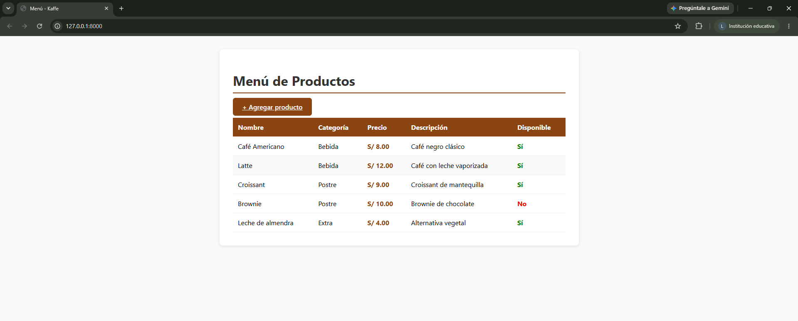
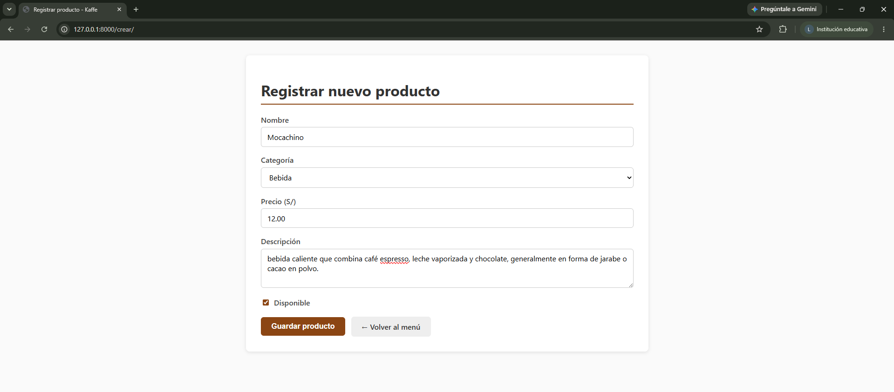
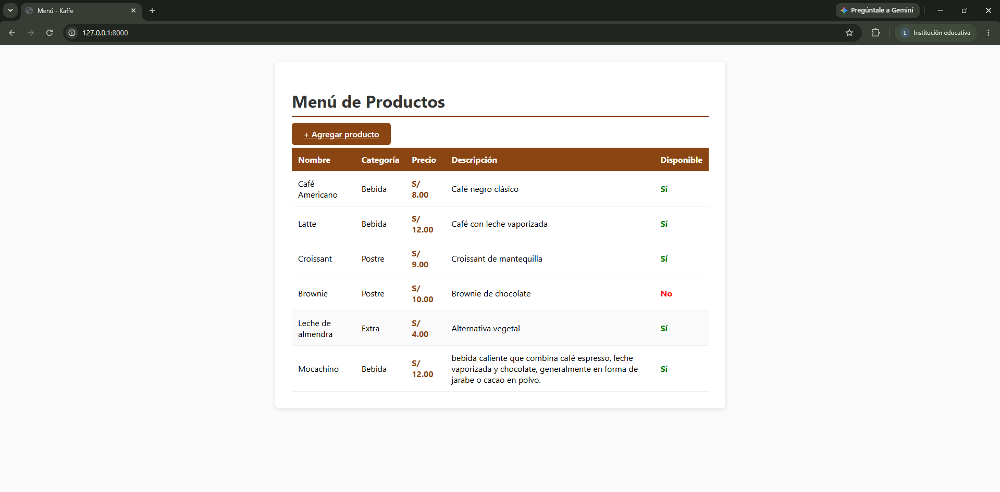

# Ejercicio 9 — Verificación del flujo completo

En este ejercicio probamos la aplicación de principio a fin y explicamos, de forma
sencilla, cómo viaja la información en Django: qué pasa desde que el usuario pide
una página hasta que la ve en pantalla.

---

## Cómo funciona el flujo (en palabras simples)

Django organiza todo en bloques que se conectan en cadena. Cuando abres la app:

1. **Tú pides una página** (escribes una URL en el navegador).
2. **Django busca dónde está esa URL** en un archivo que se llama `urls.py`.
3. **Encuentra una vista** (`views.py`), que es la función encargada de atender ese pedido.
4. **La vista consulta los datos** (`models.py`). En este proyecto los datos son
   una lista simple que vive en la memoria, sin base de datos.
5. **La vista arma la página** con un template (`*.html`).
6. **Te devuelve la página** lista para ver en el navegador.

Ese recorrido es lo que en Django llaman **MVT**: Model (datos), View (lógica) y
Template (presentación).

---

## El recorrido paso a paso

### 1. Ver el listado de productos

Entras a la página principal y ves la tabla con todos los productos del menú.

- La ruta `/` lleva a `lista_productos`.
- La vista lee la lista `PRODUCTOS` (los datos de ejemplo) y se la pasa al template.
- El template dibuja la tabla y tú ves el resultado.

### 2. Abrir el formulario para crear un producto

En el listado hay un botón **"+ Agregar producto"** que nos lleva al formulario.

- La ruta `/crear/` lleva a `crear_producto`.
- La vista muestra un formulario (`ProductoForm`) con los campos: nombre, categoría,
  precio, descripción y disponibilidad.

### 3. Llenar el formulario y guardar

Escribimos un producto nuevo (por ejemplo, un "Capuchino" a S/ 13.00) y le damos a
guardar.

- Al enviar, los datos van por el formulario a la misma vista `crear_producto`.
- La vista **valida** que los datos sean correctos.
- Si todo está bien, **agrega el producto a la lista `PRODUCTOS`** (en memoria).
- Luego **nos redirige de vuelta al listado**.

### 4. Ver el nuevo producto reflejado

Volvemos solos al listado y ahí ya aparece el producto que acabamos de crear.

- La vista del listado lee la lista ya actualizada (con el producto nuevo incluido).
- El template muestra la tabla con ese producto visible.

**Resultado:** el "Capuchino" (S/ 13.00) aparece en la tabla después de crearlo.

---

## Conexión entre el proyecto y la app

Django separa dos cosas:

- **El proyecto (`kaffe/`)** se encarga de la configuración general (rutas, ajustes).
- **La app (`core/`)** tiene la lógica de la cafetería (vistas, datos, formularios,
  templates).

El proyecto "le habla" a la app de dos formas:

1. **La registra** en `settings.py` (listado `INSTALLED_APPS`), para que Django sepa
   que existe.
2. **Le apunta las rutas** en `urls.py`: cada dirección (/, /crear/) se conecta con
   una vista de `core`.

Así el proyecto organiza todo y la app hace el trabajo de mostrar y guardar
productos.

---

## Nota: los datos viven en memoria

Como esta app **no usa base de datos**, los productos guardados se almacenan en la
lista de `models.py`, que solo existe mientras el servidor está prendido. Si apagamos
y volvemos a encender el servidor, los productos creados desaparecen y vuelve a
aparecer solo la lista de ejemplo. Esto es un comportamiento esperado en este
laboratorio.